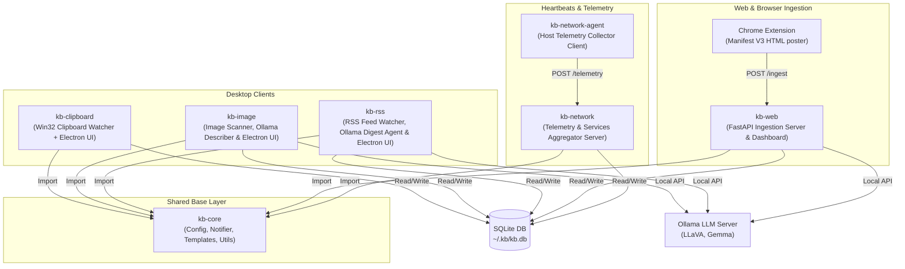

# Welcome to Your Digital Garden 🌿

Welcome to the **kb (Knowledge-Base) Stack** documentation site! 

The `kb` ecosystem isn't just a set of database wrappers—it's a cozy, privacy-first, locally-hosted **Digital Garden** designed to gather, organize, and cultivate what you copy, see, read, and build. By combining vertical-slice Python microservices, native Electron clients, and local LLMs (via Ollama), we create a system that serves as both a private personal archive and a structured environment where autonomous AI agents can help you map out your knowledge.

### Our Core Philosophy
1. **Privacy Above All**: Your thoughts, clipboard history, web clips, and photos are yours alone. Everything runs on local iron, bypassing third-party cloud APIs.
2. **Built for Human-Agent Symbiosis**: We model our data using simple sqlite structures and Pydantic validation so it is easy for you to browse, but also extremely structured for LLM agents to read, summarize, and catalog.
3. **Craftsman Visuals**: We believe internal tooling shouldn't look like boring gray enterprise software. We design our layouts to feel organic—using warm tans, earthy grays, and solarized cream tones inspired by 1930s WPA National Park posters.

This site contains guides, CLI commands, and database structures to help you tend to this system. Let's make it grow!

---

## System Architecture Overview

The `kb` ecosystem consists of several specialized components:

---

## Ecosystem Components

### 1. [kb-core](kb-core.md)
The foundational library providing directory roots configuration (`~/.kb`), centralized SQLite utilities (`sqlite-utils`), Jinja2-based HTML rendering, Gotify notifications client, file embedding helpers, and image thumbnail extraction.

### 2. [kb-clipboard](kb-clipboard/README.md)
A clipboard monitoring daemon that intercepts system clipboard actions (text, files, images) and logs them. Includes a retro solarized-light styled Electron app to browse, search, and manage clipboard history.

### 3. [kb-image](kb-image/README.md)
An image explorer and tagger that indexes local images, extracts EXIF headers, generates thumbnails, categorizes image types, and interacts with Ollama's multimodal vision model (LLaVA) to generate natural language descriptions and semantic search tags.

### 4. [kb-rss](kb-rss/README.md)
An AI-powered RSS aggregation and curation engine. Features a background daemon parsing feeds, and a taste curation agent that reads user interaction history and uses Ollama to generate a tailored daily digest.

### 5. [kb-web](kb-web/README.md)
The gateway for web scraping and ingestion. Includes a FastAPI server for tab captures, dashboard views with history snapshots, and a Chrome manifest v3 extension to push page contents directly to the local knowledge base.

### 6. [kb-network](kb-network/README.md)
The centralized network monitoring dashboard. It exposes endpoints to receive system telemetry (CPU, RAM, Disks, Docker, Ollama status) from various hosts and tracks database uptime and triggers Gotify notification alerts.

### 7. [kb-network-agent](kb-network-agent/README.md)
A lightweight agent running on individual servers to aggregate telemetry statistics and dispatch heartbeats back to the central `kb-network` server.

---

## General Design System

All user interfaces within the `kb` stack adhere to a unified style language:
- **Default Theme**: `solarized-light` (earthy cream background, warm gray borders, soft shadows, large readable text).
- **Dark Theme**: `retro-dark` (earthy browns, deep tans, dark warm grays, muted highlight accents).
- **Highlights**: Retro orange and turquoise accents.
- **Layouts**: High-contrast, spacious design with fixed sidebars, offscreen drawers, and clean fonts (e.g., Outfit, Inter).
